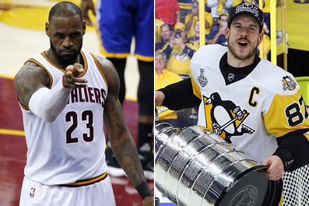

# ***Hart and Soul***

# Thank you for visiting my project.

### I hope to use data analysis to explore the effects of teammate contributions to individual accolades in sports. I will be placing a particular focus on the MVP award in the NBA and the congruent Hart Trophy award in the NHL

While both basketball and hockey are complex team sports, it is often believed that any given basketball game can be influenced most strongly by the pressence of one or two key players (think LeBron Durant or Kevin Durant) while more randomness exists in hockey (having a norris trophy-winning defensemen doesn't guarantee the opposition will not score on you). I hope to use data to see how much teammates' contributions matter in the awards for the league's best player. I will be comparing teammate statistics to league averages, looking for trends in player info (such as draft position), and performing other types of statistical inquiries as I work toward my goal of understanding the effect of teammates on individual accolades. I hope to have some stories to tell at the end of this and also would like to have advice for any person trying to understand how to predict who will win awards.