# ***Hart and Soul***

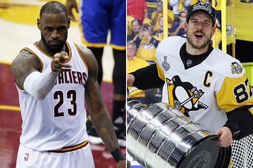

# Thank you for visiting my project.

### I will use data science to explore the effects of teammate contributions to individual accolades in sports. I will be placing a particular focus on the MVP award in the NBA and the congruent Hart Trophy award in the NHL.

While both basketball and hockey are complex team sports, it is often believed that any given basketball game can be influenced most strongly by the pressence of one or two key players (think LeBron Durant or Kevin Durant) while more randomness exists in hockey (having a norris trophy-winning defensemen doesn't guarantee the opposition will not score on you). I hope to use data to see how much teammates' contributions matter in the awards for the league's best player. I will be comparing teammate statistics to league averages, looking for trends in player info (such as draft position), and performing other types of statistical inquiries as I work toward my goal of understanding the effect of teammates on individual accolades. I hope to have some stories to tell at the end of this and also would like to have advice for any person trying to understand how to predict who will win awards.

### Searching for data.

I looked all over the internet to find data. I found a lot of NBA and basketball data such as player descriptions and statistics but had trouble finding data about hockey and the NHL. While I initially found a lot of basketball data and spent a lot of time working with it in order to compose a comprehensive data base representing the NBA, I ultimately scrapped that plan in favor of webscraping on a much larger scale. What I mean by this is that my data on advanced stats, for example, only surveyed recent seasons, and other sources were incomplete as well. I created a good webscraping function for hockey and used that to find NBA data. As a result, I lost the subtleties of advanced stats but had a more consistent representation of the NBA across their entire history. As I moved further away from 2020, I lost some data such as blocks which were not recorded in early league days, but there would literally be no way of getting that data. What this means is that the weight of the remaing features, such ass points per game, would contribute more into determining a player's value. I would like to credit the https://www.sports-reference.com/ network of data in many different sports for helping me get my data. One problem / limitation in my collection process, which applied to hockey too was that I didn't account for trades or free agency. If a player was on Chicago and moved to Detroit, my function assigns him to detroit for the entire year. bWith hockey and the NHL, I used https://www.sports-reference.com/ again. At first, I had trouble finding csv files for hockey, but that turned out to be a blessing. I needed to webscrape from the beginning and not tediously merge a bunch of different data frames. Originally, I used one csv for data up to 2018 and webscraped the 2019-19 season. I changed all my data to webscraped data for two reasons. Reason 1: I needed to account for trades and player movement; if a player moves, their team gets designated as "TOT" for total. I wanted to assign the final team a player is on in a season as their team and not lose data for all the players who moved teams. Reason 2: The csv I started with was missing over 20 years of data. Weirdly, the 2005-06 NHL season needed special scraping rules as it recorded traded players differently that all other years. I'd like to quickly note that I created a function for skaters and a function for goalies as they have different stat categories. Interestingly, on https://www.sports-reference.com/ the skater stats remain unchanged between 1918 and 2007, even with missing values, but new stats are added in 2008. Goalie stats stayed the same between 1918 and 2020, which was convenient. This change in skater stats was inconvenient and bothered me for a bit as I was scared that the statistics for skaters would change a lot more than once, but it worked out nicely that they changed only once.

### A bit about the web scraping I did.

#### The website:
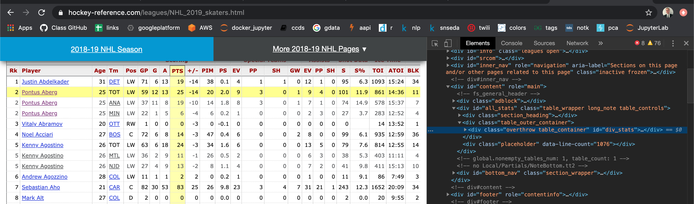

Creating my webscarping function in the very beginning was an easily scalable function, but was difficult to build. I have little experience with webscraping and needed to do some form of guess-and-check, but worked hard and created a nice and robust function. I'll display part of the function below. While it was robust, some parts of the process were hard to consolidate, so the code is not the most efficient at times, but it works effectively toward the general end goal.

### Here, I will show some code from my data engineering process described above.

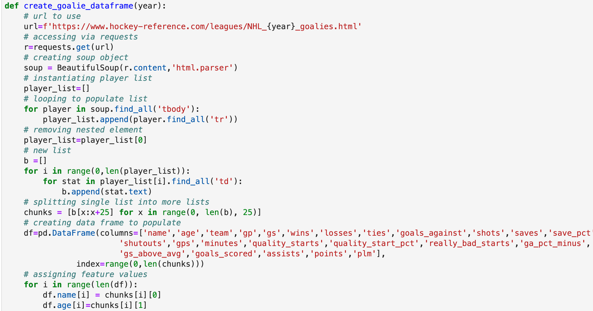

a little is cut off - in the middle of the function

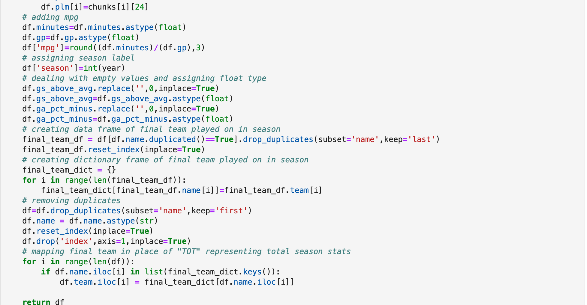

### Linking to award winners.

After scraping my data for NBA players, NHL goalies, and NHL skaters to have a complete and comprehensive review of every player in any season (like ever) I saved my data into CSV files so I could use them as I went forward with my project and share the databases I generated with other people. I now understand why people need this data as it appears to be a lot harder to find than I had expected and plan on sharing this data. In addition, having gathered my data, I was now ready to move forward and focus on the teammates of MVP / Hart Trophy winners and finished up all the webscraping by generating a list with every winner, the year they won it, and the team they played for (did you know there was only one player who switched teams mid-season to win the Hart Trophy in NHL history?). I saved those lists to csv files afterward.

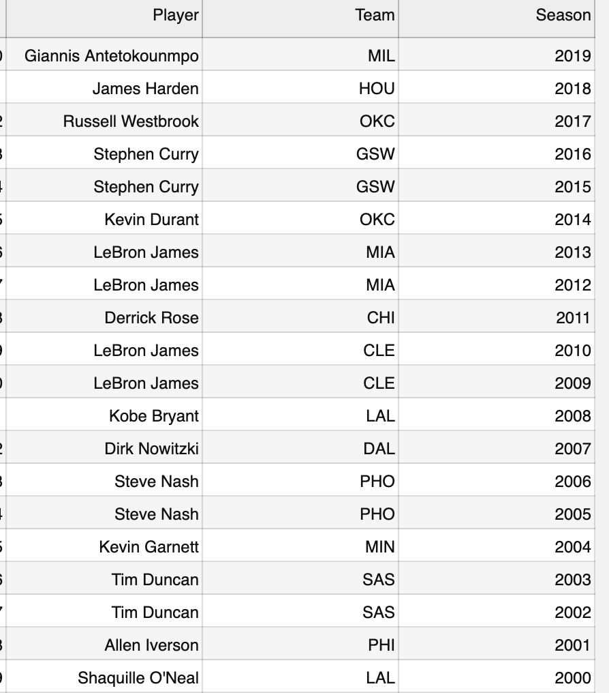

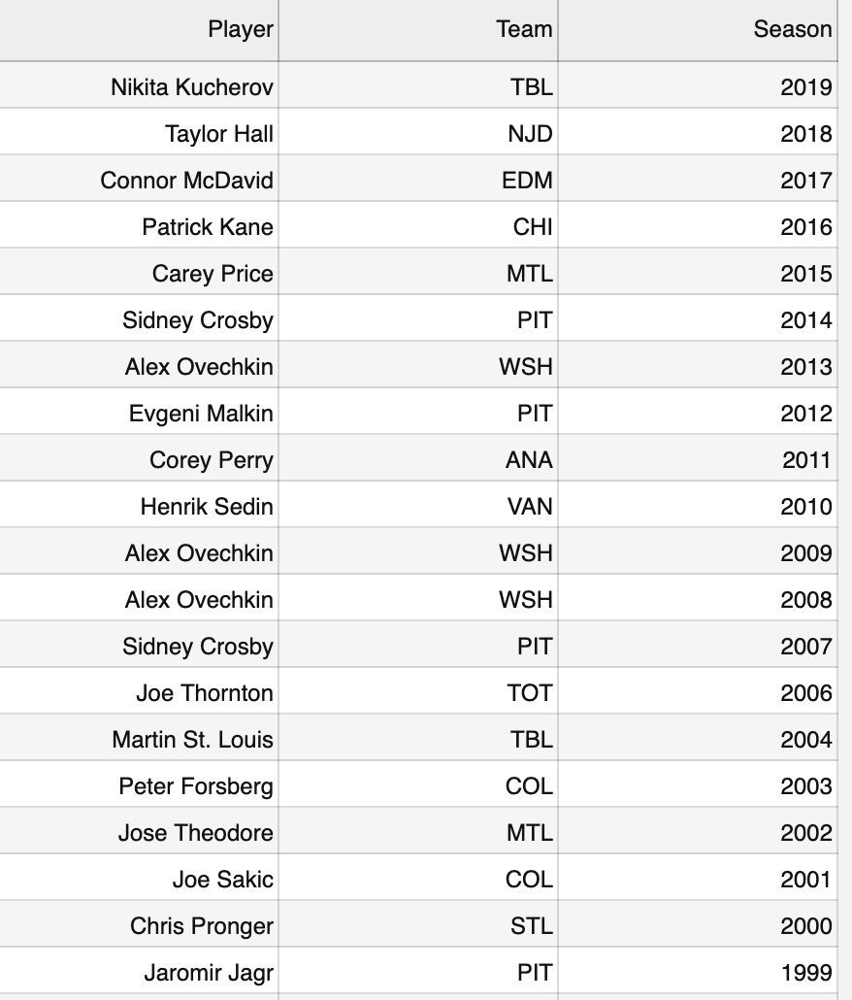

### Plans versus what actually happened.

When I started this project, I had expected it to move rather quickly. It did not. That has very little to do with the complexity of the project, however. I got really excited by all the data and insights I was generating and decided to add more and mroe information and go way beyond just the teammates of award winners. I created data sets with all types of ways to evaluate players. I created data bases with stats, data bases with quantiles, and data bases with custom metrics I created, among others. In fact, by adding all this extra data, I uncovered some glitches and other problems and went all the way back to the beginning to address those problems. An example of this is the problem with players moving teams described above. At the beginning, I wanted to look at the past 40 years of each sports and only look at teammates of award winners. My main inquiries will be limited to that context, but I still generated a lot of data.

### Creating relative measures of player performance on a per-season basis.

Having gathered all my data, I was ready to develop some metrics to better understand and evaluate the performance of each individual player on a per-season basis. I'd like to stress this per-season basis. My ultimate metric I create at the very end of this process displays how good a player is good compared to his competition THAT YEAR ONLY. Some years are just better than other years. Sometimes, the whole league improves and distinguishing which player reigns supreme can be difficult. The distribution of players on the "great to terrible scale" is in a constant state of flux. I tend to believe every sports league in North America tends to follow a normal distribution with regards to talent. Nevertheless, the mean can shift, the variance can increase or decrease, and the kurtosis and skewness may move around.

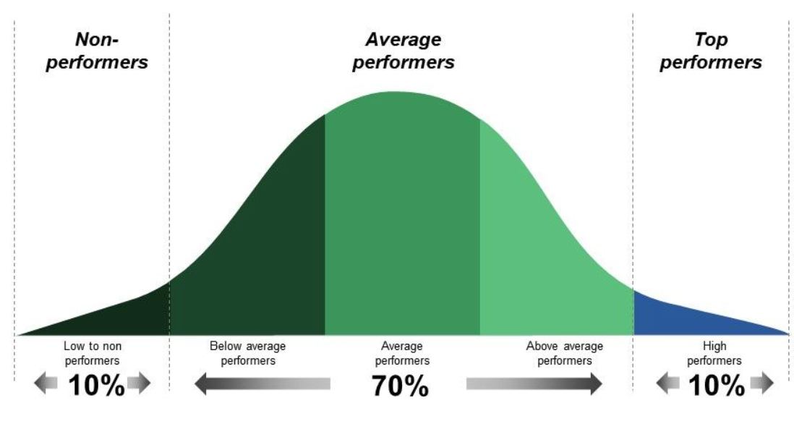

The point is, we need to know the answer to the following question: was the best player in the league playing with other players who stood out amongst the rest of the league or were they just average or even below average. To accomplish this task, I divided every player's statistics by the mean value of that statistic during each season. Example: if the average goals scored in 2008 per player were 10 goals and a guy like Sidney Crosby scored 35 goals (made-up numbers), I would assign a 3.5 to goals (35 goals / 10 average). For skaters, all my stats I used to later develop a metric of performance were positive (except penalty minutes) in the sense that more is better. This was not the case for goalies and nba players. For examples, high goals-against-averages or turnover-ratios (for goalies and nba players, respectively) are not desirable stats. After finding out the ratio of each statistic to league average for every season and every player in NBA and NHL history, I was now very close to that ending and defining evaluation metric.

To get a final metric for player performance, I basically did the following three tasks. The first thing was apply Max-Absolute-Scaling to remove imnpacts from magnitude alone and put my data on a even level across all statistics. The effect, mathematically is that all my data will be on the interval [0,1]. Next, I took the arithmetic mean of key statistics (not all statistics. I did't include things like age or 3 pointers attempted in the NBA just to name a few). I also accounted for "good sats" vs. "bad stats." Bad stats weighed your rating down and good stats improved your rating. In addition, I did a little extra "custom" feature scaling such as adjusting the impact of statistics that deserve a larger impact or important statistics that still deserve a reduced impact. Also, for defensemen and forwards - who are both skaters - I created two separate metrics; one for defensive impact and one for offensive impacty. Having gotten my mean metric which described all the player's relevant skills and evaluated their impact, I took my final step by dividing this statistic over the maximum overall mean metric across each season to account for variability in skill level (and luck I suppose) across seasons as discussed earlier.

### Here is a look at my function (for NHL skaters, as an example) and some of the outcomes.

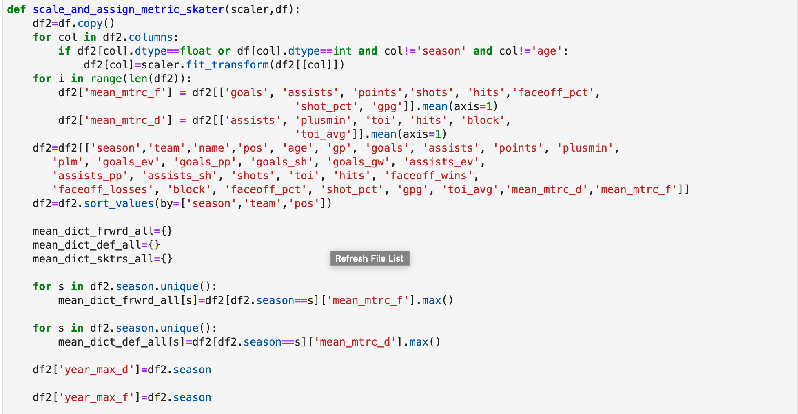

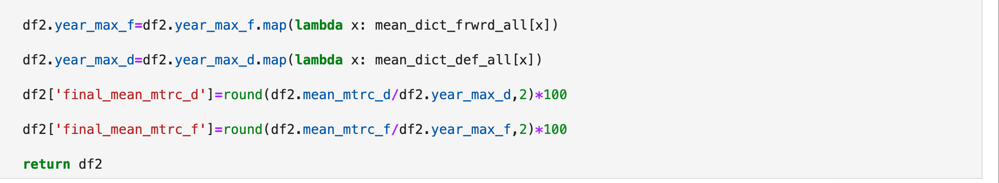

## and the results...

## for basketball...

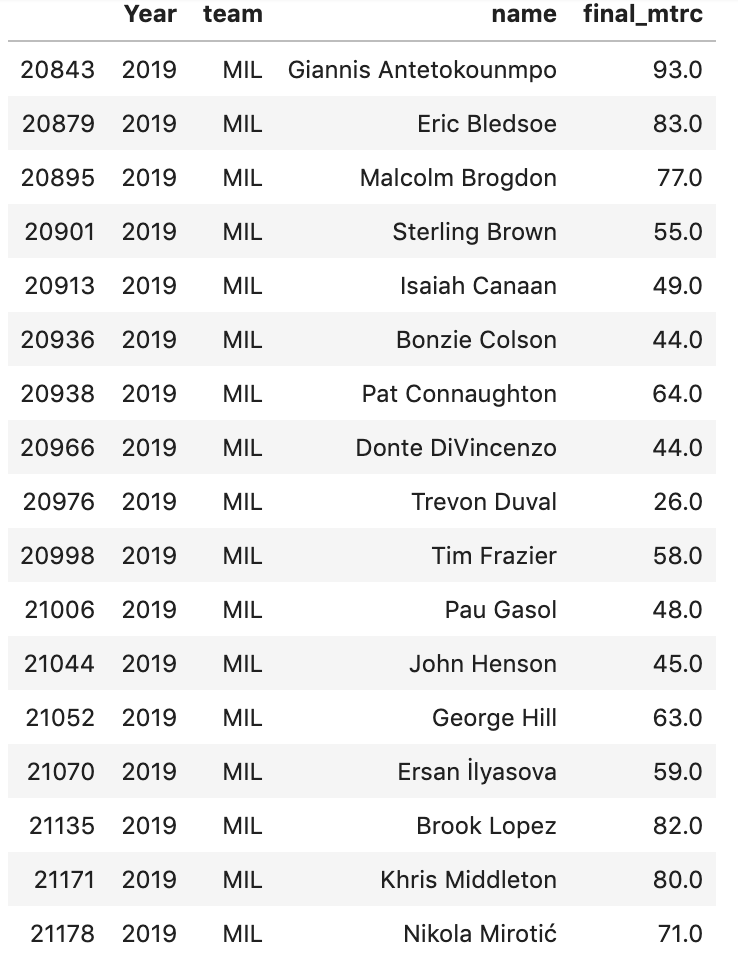

## and for hockey...

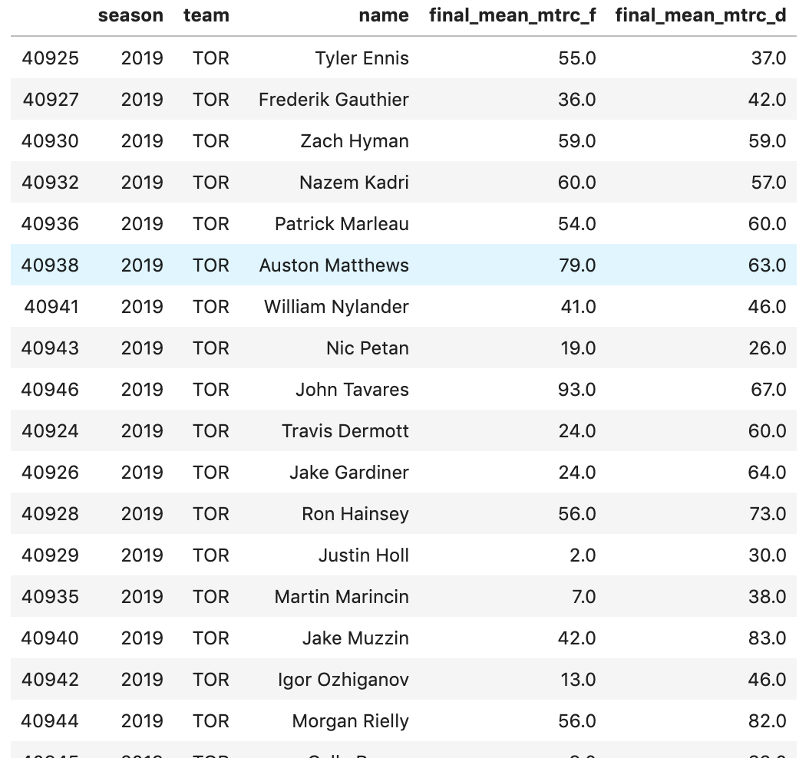

### Grouping teams with an award winner using my custom metric.

Having now created a custom metric which effectively evaluates the effectiveness and value each player adds to their team across NHL defensemen, forwards, and goalies as well as all NBA players, I was ready to group this data by year, team, and position and look at the median, maximum, and (of course) mean values of my metric for the team surrounding each MVP and Hart Trophy winner. I decided to export this data to Excel as there were a couple of tasks I felt would be short and just easier to do in Excel which would help me capture the contribution of each player on the team. I will provide an image below to give you an idea of what these data frames would look like in pandas.

#### My photos reflect many seasons for goalies, the 2011 season which saw Derrick Rose win the MVP in the NBA with the Chicago Bulls, and the 2019 season which saw Nikita Kucherov win the Hart Trophy in the NHL with the Tampa Bay Lightning.

# Rose (at PG).

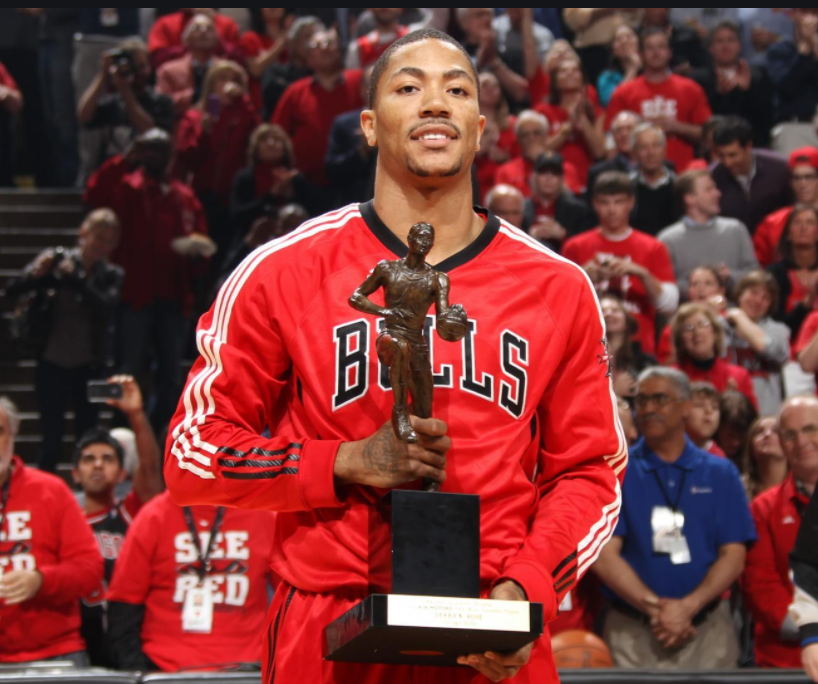
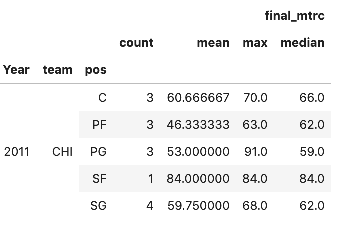

# Kucherov (at RW).

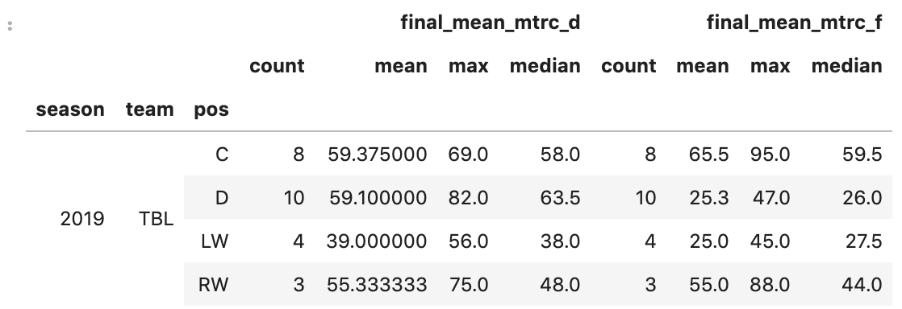

# Many Goalies
#### I picked Gretzky because he won all those "EDM" trophies.

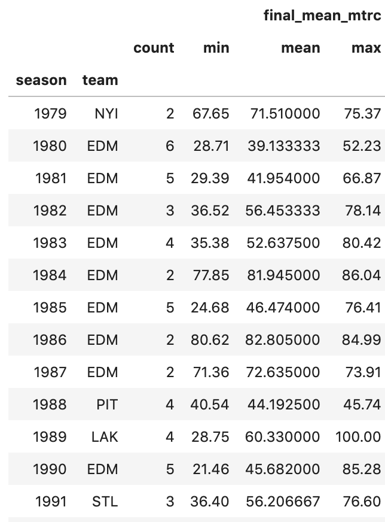